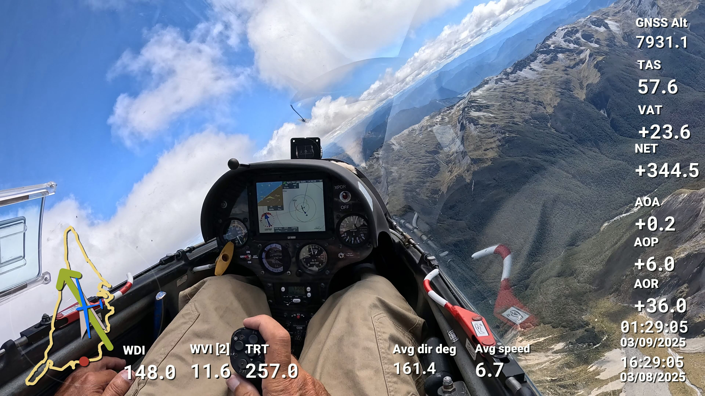

# igc2csv.py
Python script to convert IGC files to CSV with Python. Output includes I-Record defined added fields 
for B-Records and J-Record defined added fields for K-Records. CSV versions of B-Records and K-Records 
output to different files. Timestamps convert to ISO Date-times (UTC)), and assume the availability 
of an HFDTEDATE: record in the IGC file.

# wind_average.py
In the case of LXNav LX90xx glide computers, as of March 2025, the K-Records contain HAWK instantaneous winds
if HAWK is activated. This was according to Uros at LXNav. The "wind_average.py" script in the "LXNav Specific"
directory takes these winds and calculates the vector average over a rolling window that defaults to 30
records (lines) in the K-Records CSV (as output by igc2csv.py). The K-Records from my LX9000 are mostly 
1 each second, but not always, so it's not based on time, just some number of previous lines in the input.

The Python was written in cooperation with ChatGPT.

# use with GoPro cockpit video and the Telemetry Overlay application
The GoPro camera I use to record cockpit video embeds GPS position and time data in the video files along 
with sensor data like accelerometer readings. I've been overlaying this stuff on cockpit videos with a
MacOS program called "Telemetry Overlay" to help with post-flight analysis. You would think syncronizing
the video with IGC data based on GPS time would just work, but I've found the IGC data are offset from the
video by 2 seconds, based on the LX9000 time-of-day info box I can see in the video recording.

Telemetry Overlay supports showing heading-like 360 data with rotating images or arrows, and I've been able
to build a stack of these that tracks quite well with the wind symbols I can see on the LX9000.

So, it's been helpful for me to be able to see something close to the info I could display on the LX9000 in
flight, while watching and listening retrospectively. Things I'm looking for include what are the LX wind
symbols saying when I think I'm following a convergence; or when the sun is on one side of a ridge but the 
wind is on the other, can the wind arrows help me choose the best place to fly? 

**Example of a video frame with overlaid data from an IGC file**
